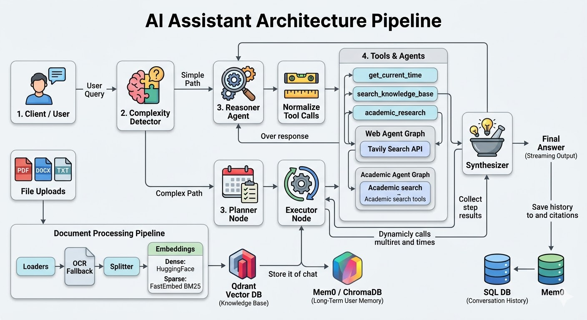
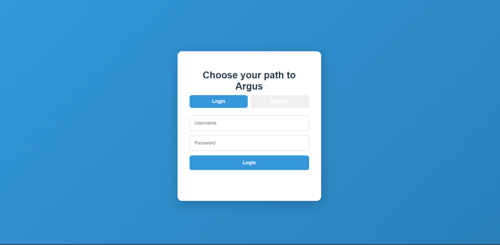
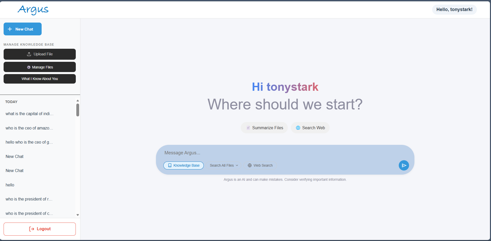
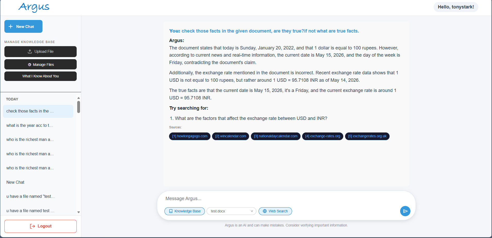

# Agentic RAG Chatbot 

## Project Overview
Argus is a multi-agent orchestration system built around hybrid Retrieval-Augmented Generation (RAG). Using autonomous routing, the system dynamically evaluates user queries to execute specialized tools—such as querying uploaded documents via Qdrant Cloud, browsing the live web, or searching academic databases. It maintains stateful, context-aware interactions through JWT-secured user sessions, persistent chat histories stored in a serverless SQL database, and a dedicated cognitive memory layer for long-term user context.

Technical Stack & Decision Log
LLM Engine: LLaMA-3.3-70B via Groq

Model: llama-3.3-70b-versatile (Groq hosted)

Why over GPT-4o/Claude: Groq's LPU inference is significantly faster, generating tokens at speeds necessary for a responsive, real-time streaming UI. LLaMA-3.3-70B matches GPT-4-class quality on structured tool-calling and JSON-mode outputs.

Why not local SLMs: Tool-calling reliability and multi-step reasoning degrade quickly on smaller local models. Groq provides the reasoning power of a 70B parameter model with API latency lower than local execution.

Agent Framework: LangGraph

Framework: langgraph + langchain-core

Why over standard LangChain (ReAct) or CrewAI: Standard chains are too rigid for dynamic tool use. LangGraph treats the agent as a cyclic state machine (nodes and edges). This allows Argus to utilize a complexity detector, plan multi-step execution, and loop through tools autonomously without hardcoded sequential logic.

Databases: Qdrant Cloud & Turso

Vector DB (Qdrant Cloud): Chosen over local ChromaDB to survive serverless backend deployments. Qdrant is Rust-based, highly memory-efficient, and natively supports the Hybrid Search (combining dense and sparse embeddings) required for accurate document RAG.

Relational DB (Turso/libsql): Chosen over standard SQLite or Postgres. Turso is a serverless database built on libsql. It allows standard SQLite syntax without the risk of the database file being wiped during Render/Vercel server restarts, eliminating the need to rewrite the entire database layer for PostgreSQL.

Memory Layer: Mem0

Architecture: Mem0 integrated directly into a dedicated Qdrant collection (argus_memory), completely decoupled from the document RAG collection.

Why: Traditional LLMs suffer from context window bloat if full chat histories are injected into the prompt. Mem0 acts as a background cognitive layer, extracting standalone facts from conversations and fetching only highly relevant user details for future interactions.

Frontend UI: Vanilla HTML/JS + Server-Sent Events (SSE)

Why over Streamlit/Gradio: Python UI frameworks abstract away too much control, making it impossible to build custom streaming animations, bespoke tool-status indicators, and independent grid layouts. Vanilla JS with standard fetch() and SSE allows for a professional, low-latency, and fully customizable decoupled architecture.

## Key Features
* **Agentic Tool Calling:** The LangGraph agent decides when to trigger the `search_knowledge_base` tool versus answering directly.
* **Multi-Tenant Security:** JWT-based authentication ensures users can only access their own documents and chat histories.
* **Dual-Memory System:** SQLite handles exact UI chat histories, while ChromaDB handles semantic long-term memory for the agent.
* **Dynamic Chunking:** Automatically processes, splits, and embeds PDFs, TXTs, and DOCXs into Endee.

---
How to Run Locally
Follow these steps to run the Argus orchestration system locally. Ensure you have Python 3.11+ and Git installed.

1. Clone the Repository
Clone the repository to your local machine and navigate to the backend folder:

Bash
git clone https://github.com/your-username/argus.git
cd argus/backend
2. Set Up Environment Variables
Create a .env file in the backend directory. Argus relies on cloud databases, so you will need to provision free-tier accounts for Groq, Qdrant Cloud, and Turso.

Code snippet
# API Keys
GROQ_API_KEY=your_groq_key
HUGGINGFACEHUB_API_TOKEN=your_hf_token
JWT_SECRET_KEY=your_secure_random_string

# Cloud Databases
TURSO_DATABASE_URL=libsql://your-db-url.turso.io
TURSO_AUTH_TOKEN=your_turso_token
QDRANT_URL=https://your-cluster-url.cloud.qdrant.io:6333
QDRANT_API_KEY=your_qdrant_token

3. Install Dependencies
It is highly recommended to use a virtual environment to prevent OS-level library conflicts.

Bash
python -m venv venv
source venv/bin/activate  # On Windows use: venv\Scripts\activate
pip install -r requirements.txt

4. Start the Backend Server
Run the FastAPI backend using Uvicorn. The database.py file will automatically connect to Turso and generate the necessary SQL tables on first boot.

Bash
uvicorn main:app --host 127.0.0.1 --port 5000 --reload
The backend is now running and listening for API requests at http://127.0.0.1:5000.

5. Launch the Frontend UI
Navigate to the frontend directory.

Open script.js and ensure the API_BASE_URL points to http://127.0.0.1:5000 for local development.

Open index.html in your browser (or use VS Code Live Server) to access the chat interface. Register a new account to begin.
(Tip: Ensure your VS Code workspace ignores the local database files to prevent Live Server from automatically refreshing the page when the AI saves a message!)

**Architecture diagram**

### Project Showcase:

**1. login Page(after registration then login with id password)**

**2. First glance**

**3. Demo(upload your document and ask question)**

